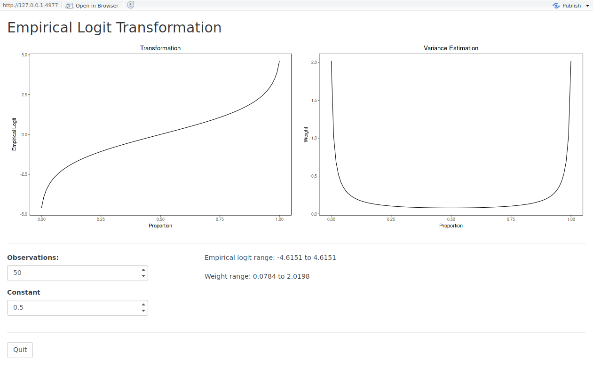
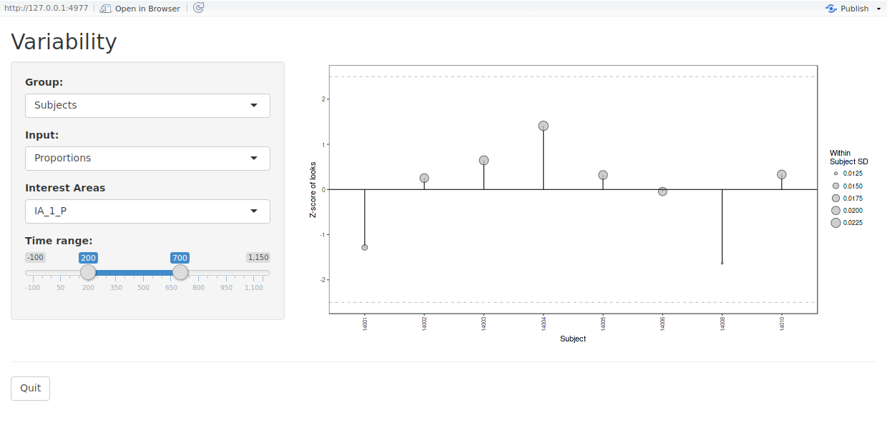
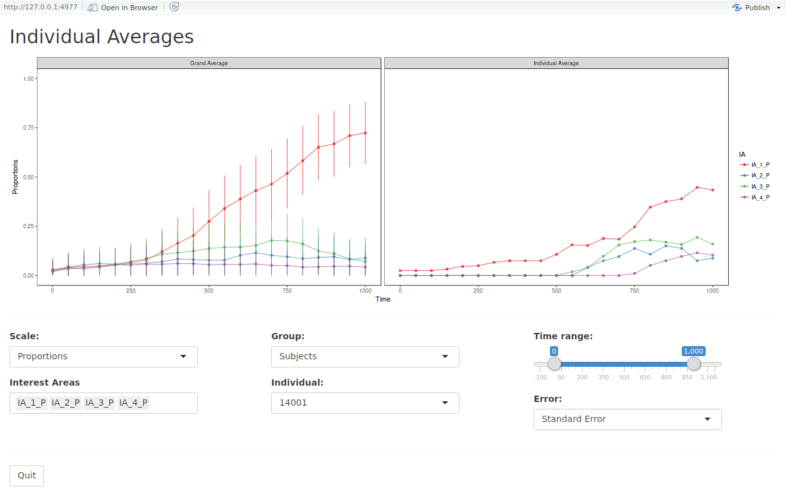

```{r global_options, include=FALSE}
library(ggplot2)
library(gridExtra)
library(itsadug)
knitr::opts_chunk$set(fig.width=6, fig.height=4, fig.align="center", warning=FALSE)
```

```{r, eval = TRUE, echo=FALSE, results='hide', message=FALSE}
library(VWPre)
data(VWdat)
dat <- fasttrack(data = VWdat, Subject = "RECORDING_SESSION_LABEL", Item = "itemid", 
	EventColumns = c("Subject", "TRIAL_INDEX"), NoIA = 4, Adjust = 100, Recording = "LandR", 
  WhenLandR = "Right", BinSize = 50, SamplingRate = 1000,
  ObsPerBin = 50, Constant = 0.5, Output = "ELogit")
```

## Plotting the data

It's often desirable to visualize the proportion (or empirical logit) data, either as a grand average or by condition.
In some cases it is even necessary to visualize the trend in the data over a continuous predictor. 
So, the functions `plot_avg` and `plot_avg_contour` provide straightforward plotting options for such cases.
These functions internally calculate the average(s) and plot the results.
The plotting is powered by `ggplot2`, so further customization (plot titles, custom themes, etc.) is still possible.
For more information about [ggplot2](http://ggplot2.tidyverse.org/reference/), please refer to its reference manual and extensive documentation.

### Averaged data

Using the function `plot_avg`, it is possible to plot the overall average of the data by interest area. 
The parameter `type` specifies which type of plot to create: proportion or empirical logit.
In `IAColumns`, list the interest area proportion columns (here we have used the default names) along with desired labels.

```{r, eval= TRUE, fig.show='hold', results='asis', message=FALSE}
plot_avg(data = dat, type = "proportion", xlim = c(0, 1000), 
    IAColumns = c(IA_1_P = "Target", IA_2_P = "Rhyme", IA_3_P = "OnsetComp", 
                  IA_4_P = "Distractor"),
    Condition1 = NULL, Condition2 = NULL, Cond1Labels = NA, Cond2Labels = NA,
    ErrorBar = TRUE, VWPreTheme = TRUE) 
```

To add a title to the plot, simply add the title function from `ggplot2`.

```{r, eval= TRUE, fig.show='hold', results='asis', message=FALSE}
plot_avg(data = dat, type = "proportion", xlim = c(0, 1000), 
    IAColumns = c(IA_1_P = "Target", IA_2_P = "Rhyme", IA_3_P = "OnsetComp", 
                  IA_4_P = "Distractor"),
    Condition1 = NULL, Condition2 = NULL, Cond1Labels = NA, Cond2Labels = NA,
    ErrorBar = TRUE, VWPreTheme = TRUE) + ggtitle("Averaged Data")
```

To customize the appearance of a plot (e.g., font, size, color, margins, etc.), the `VWPreTheme` parameter can be set to `FALSE`, which reverts to the default theming in `gglpot2`. 
In this way, the user can apply a custom theme to the plot. 
Detailed information about creating themes can be found at [ggplot2 Theme Vignette](http://ggplot2.tidyverse.org/reference/theme.html).
For the purpose of illustration, the default ggplot2 theme has been applied, with the axis text elements increased in size.

```{r, eval= TRUE, fig.show='hold', results='asis', message=FALSE}
plot_avg(data = dat, type = "proportion", xlim = c(0, 1000), 
    IAColumns = c(IA_1_P = "Target", IA_2_P = "Rhyme", IA_3_P = "OnsetComp", 
                  IA_4_P = "Distractor"),
    Condition1 = NULL, Condition2 = NULL, Cond1Labels = NA, Cond2Labels = NA,
    ErrorBar = TRUE, VWPreTheme = FALSE) + theme(axis.text = element_text(size = 15))
``` 


### Conditional averages

The function `plot_avg` can also be used to plot averages for different conditions, based on a factor variable in the data.
If the current factor level labels are not suitable for plotting, specify new labels using a list in `Cond1Labels`. 

Specifying Condition1 will stack the plots. 

```{r, eval= TRUE, fig.show='hold', fig.height=5, results='asis', message=FALSE}
plot_avg(data = dat, type = "proportion", xlim = c(0, 1000), 
    IAColumns = c(IA_1_P = "Target", IA_2_P = "Rhyme", IA_3_P = "OnsetComp", 
                  IA_4_P = "Distractor"), Condition1 = "talker", 
    Condition2 = NULL, Cond1Labels = c(CH1 = "Chinese 1", CH10 = "Chinese 3", 
                                     CH9 = "Chinese 2", EN3 = "English 1"),
    Cond2Labels = NA, ErrorBar = TRUE, VWPreTheme = TRUE)
```

Alternatively, specifying just Condition2 will plot the same information, but align it horizontally.

```{r, eval= TRUE, fig.show='hold', fig.width=7, fig.height=3.5, results='asis', message=FALSE}
plot_avg(data = dat, type = "proportion", xlim = c(0, 1000), 
    IAColumns = c(IA_1_P = "Target", IA_2_P = "Rhyme", IA_3_P = "OnsetComp", 
                  IA_4_P = "Distractor"), Condition1 = NULL, 
    Condition2 = "talker", Cond1Labels = NA, Cond2Labels = c(CH1 = "Chinese 1", 
                                                             CH10 = "Chinese 3", 
                                                             CH9 = "Chinese 2", 
                                                             EN3 = "English 1"), 
    ErrorBar = TRUE, VWPreTheme = TRUE)
```

For a 2x2 design, it is possible to specify both conditions. 
This will create a grid-style plot.

```{r, eval= TRUE, fig.show='hold', fig.width=7, fig.height=5, results='asis', message=FALSE}
plot_avg(data = dat, type = "proportion", xlim = c(0, 1000), 
    IAColumns = c(IA_1_P = "Target", IA_2_P = "Rhyme", IA_3_P = "OnsetComp", 
                  IA_4_P = "Distractor"), Condition1 = "talker", 
    Condition2 = "Exp", Cond1Labels = c(CH1 = "Chinese 1", CH10 = "Chinese 3", 
                                     CH9 = "Chinese 2", EN3 = "English 1"),
    Cond2Labels = c(High = "High Exp", Low = "Low Exp"), ErrorBar = TRUE, 
    VWPreTheme = TRUE)
```

### Error bars and Error bands

Error around the means can be plotted in two ways, either as error bars or as error bands.
Note that with the included theme, the colors and shapes change for error bands to maximize readablity.

```{r, eval= TRUE, fig.show='hold', fig.width=7, fig.height=8, results='asis', message=FALSE}
gridExtra::grid.arrange(

plot_avg(data = dat, type = "proportion", xlim = c(0, 1000), 
    IAColumns = c(IA_1_P = "Target", IA_2_P = "Rhyme", IA_3_P = "OnsetComp", 
                  IA_4_P = "Distractor"),
    Condition1 = NULL, Condition2 = NULL, Cond1Labels = NA, Cond2Labels = NA,
    ErrorBar = TRUE, VWPreTheme = TRUE),

plot_avg(data = dat, type = "proportion", xlim = c(0, 1000), 
    IAColumns = c(IA_1_P = "Target", IA_2_P = "Rhyme", IA_3_P = "OnsetComp", 
                  IA_4_P = "Distractor"),
    Condition1 = NULL, Condition2 = NULL, Cond1Labels = NA, Cond2Labels = NA,
    ErrorBar = FALSE, ErrorBand = TRUE, VWPreTheme = TRUE),
	
nrow=2, ncol=1)
``` 

### Confidence intervals (pointwise/simultaneous)

Rather than having standard error plotted, it is possible to have confidence intervals added to the graph.
Confidence intervals can be plotted either as bars or bands and controlled using `ErrorType`  and `ConfLev`.  `ErrorType` should be set to "CI" for confidence intervals, and `ConfLev` set to the desired levels of confidence (by default 95). 
An important option is the type of desired interval, either pointwise or simultaneous, using `CItype`.
Pointwise use the confidence level provided for each interval plotted.
Simultaneous are, on the other hand, corrected for multiple intervals using the Bonferroni method. 
Underlyingly this correction is done using the number of data points along the x-axis (Time).

```{r, eval= TRUE, fig.show='hold', fig.width=7, fig.height=8, results='asis', message=TRUE}
gridExtra::grid.arrange(

plot_avg(data = dat, type = "proportion", xlim = c(0, 1000), 
    IAColumns = c(IA_1_P = "Target", IA_2_P = "Rhyme", IA_3_P = "OnsetComp", 
                  IA_4_P = "Distractor"),
    Condition1 = NULL, Condition2 = NULL, Cond1Labels = NA, Cond2Labels = NA,
    ErrorBar = FALSE, ErrorBand = TRUE, ErrorType = "CI", ConfLev = 95, 
	CItype = "pointwise", VWPreTheme = TRUE), 

plot_avg(data = dat, type = "proportion", xlim = c(0, 1000), 
    IAColumns = c(IA_1_P = "Target", IA_2_P = "Rhyme", IA_3_P = "OnsetComp", 
                  IA_4_P = "Distractor"),
    Condition1 = NULL, Condition2 = NULL, Cond1Labels = NA, Cond2Labels = NA,
    ErrorBar = FALSE, ErrorBand = TRUE, ErrorType = "CI", ConfLev = 95, 
	CItype = "simultaneous", VWPreTheme = TRUE),
	
nrow=2, ncol=1)
```

### Single interest area by condition

When plotting a single interest area by condition, it is very typical to plot the conditional averages in a single frame (rather than in separate facets) to facilitate visual comparison. 
If only one interest area is given, the function will output a figure in which the conditional curves are visualized in a single frame.  

```{r, eval= TRUE, fig.show='hold', fig.height=5, results='asis', message=FALSE}
plot_avg(data = dat, type = "proportion", xlim = c(0, 1000), 
    IAColumns = c(IA_1_P = "Target"), Condition1 = "talker", 
    Condition2 = NULL, Cond1Labels = c(CH1 = "Chinese 1", CH10 = "Chinese 3", 
                                     CH9 = "Chinese 2", EN3 = "English 1"),
    Cond2Labels = NA, ErrorBar = TRUE, VWPreTheme = TRUE)
```

### Calculation of averages - Mean vs. Grand mean

By default, the plotting function calculates the overall mean in the data set for a given interest area by time. 
However, by changing the input to the parameter `Averaging`, it is possible to supply a column name for which grand mean (mean of means) can be calculated (e.g., "Subject"). 
Note that for balanced data, the resultant mean will be the same, but the size of the error bars/bands will change.
For example, given the small number of participants in this data set, the error bars become much wider.

```{r, eval= TRUE, fig.show='hold', results='asis', message=FALSE}
plot_avg(data = dat, type = "proportion", xlim = c(0, 1000), 
    IAColumns = c(IA_1_P = "Target", IA_2_P = "Rhyme", IA_3_P = "OnsetComp", 
                  IA_4_P = "Distractor"),
    Condition1 = NULL, Condition2 = NULL, Cond1Labels = NA, Cond2Labels = NA,
    Averaging = "Subject", ErrorBar = TRUE, ErrorType = "SE", VWPreTheme = TRUE) 
```

### Difference plots

The function `plot_avg_diff` can also be used to plot the average difference between looks to two interest areas.
As with `plot_avg` up to two conditions can be supplied for conditional plotting.

```{r, eval= TRUE, fig.show='hold', fig.width=7, fig.height=8, results='asis', message=FALSE}
gridExtra::grid.arrange(

plot_avg_diff(data = dat, type = "proportion", xlim = c(0, 1000), 
              DiffCols = c(IA_1_P = "Target", IA_2_P = "Rhyme"), 
            Condition1 = NULL, Condition2 = NULL, Cond1Labels = NA,
            Cond2Labels = NA, ErrorBar = TRUE, VWPreTheme = TRUE),

plot_avg_diff(data = dat, type = "proportion", xlim = c(0, 1000), 
              DiffCols = c(IA_1_P = "Target", IA_2_P = "Rhyme"), 
            Condition1 = "talker", Condition2 = NULL, Cond1Labels = c(CH1 = "Chinese 1", 
            CH10 = "Chinese 3", CH9 = "Chinese 2", EN3 = "English 1"),
            Cond2Labels = NA, ErrorBar = TRUE, VWPreTheme = TRUE),

nrow=2, ncol=1)			
```

Error bands, confidence intervals (both pointwise and simultaneous), and averaging work the same way as in the `plot_avg` function.

### Conditional contour surface 

In some cases, studies have not employed a factorial design; rather they aim to investigate continuous variables.
Therefore, using the function `plot_avg_contour` it is also possible to create a contour plot representing the looks to one interest area as a surface over the continuous variable and Time.
This function calculates the average time series at each value of the continuous variable and applies a smooth (utilizing the function `gam` in the package [mgcv](https://CRAN.R-project.org/package=mgcv)) over the surface. 
The function then plots the result as a contour plot. 
Here, the example plots looks to the target as a function of Rating and Time.

```{r, eval= TRUE, fig.show='hold', results='asis', message=FALSE}
plot_avg_contour(data = dat, IA = "IA_1_P", type = "proportion", Var = "Rating", 
VarLabel = "Accent Rating", xlim = c(0,1000), VWPreTheme = TRUE, 
Colors = c("gray20", "gray90"))
```

It is possible to change the contour colors and add a title.
`ggplot2` accepts predefined palette colors, RGB, hexadecimal, among others.

```{r, eval= TRUE, fig.show='hold', results='asis', message=FALSE}
plot_avg_contour(data = dat, IA = "IA_1_P", type = "proportion", Var = "Rating", 
VarLabel = "Accent Rating", xlim = c(0,1000), VWPreTheme = TRUE, 
Colors = c("red", "green")) + ggtitle("Looks to target")
```

Averaging works the same way as in the `plot_avg` function.


## Extracting plotting data

Because the plotting functions are based on ggplot2 it is possible to easily extract the data used to create the plots.  
This is useful if you desire a highly custom plot, but would like to use the averages and error calculations produced by the plotting function. 

To extract the data, first save the plot to an object in your workspace.
This will create a list object containing the data.

```{r, eval= TRUE, results='asis', message=FALSE}
plt <- plot_avg(data = dat, type = "proportion", xlim = c(0, 1000), 
                IAColumns = c(IA_1_P = "Target", IA_2_P = "Rhyme", IA_3_P = "OnsetComp", 
                              IA_4_P = "Distractor"),
                Condition1 = NULL, Condition2 = NULL, Cond1Labels = NA, Cond2Labels = NA,
                ErrorBar = TRUE, VWPreTheme = TRUE) 
```

The data can then be accessed by extracting the dataframe from the list.

```{r, eval= TRUE, results='asis', message=FALSE}
df <- plt$data
```

```{r, eval= TRUE, echo=FALSE, results='asis', message=FALSE}
knitr::kable(head(df))
```


## Backtransformation of predicted values

The function `make_pelogit_fnc` creates a function that can be used to transform the empirical logit scale back to probability scale.
The function must be supplied with the number of samples and the constant used in the original transformation. 
This is particularly handy for backtransforming model predicitions to probability scale.

```{r, eval= TRUE, results='asis', message=FALSE}
model <- mgcv::bam(IA_1_ELogit ~ s(Time), data = dat)
pelogit <- make_pelogit_fnc(ObsPerBin=50, Constant=0.5)

df <- data.frame(Fitted = fitted(model), Backtransformed = pelogit(fitted(model)))
```

Here we see the backtransformed values.
```{r, eval= TRUE, echo=FALSE, results='asis', message=FALSE}
knitr::kable(df[10:20,])
```

Here we see how the function can be included in the plotting functions of other packages.
```{r, eval= TRUE, results='hide', fig.width=7, fig.height=8, message=FALSE}
par(mfrow=c(2,1))
itsadug::plot_smooth(model, view = "Time")
itsadug::plot_smooth(model, view = "Time", transform = pelogit)
```

## Interactive/Utility plotting apps


### Shiny app for understanding the empirical logit transformation

Because users may be inclined to perform an empirical logit transformation on their data, it is important to understand how the transformation works.
The transformation converts proportions (which are inherently bound between 0 and 1) to an unbounded measure ranging, in principle, between -Inf and Inf.
This presents the issue of the number of observations used in the calculation; this is because the number of samples in the data is inherently linked to the sampling rate at which the recording was done.
Therefore, the user may choose to change the number used in the calculation; however, the number of observations changes the shape and range of the transformed values (and their associated weights).

The function `plot_transformation_app` opens a Shiny App which allows the user to visualize the effect of both number of observations and constant on the result of the empirical logit transformation and weight calculations. These values are plotted against proportions (0 to 1). 

```{r, eval=FALSE, echo=TRUE, results='asis'}
plot_transformation_app()
```

<style>
im {
width: 100%;
text-align: center;
}
</style>

<div id='im'>
  
</div>


### Shiny app plots for data inspection 

There are two functions which provide diagnostic Shiny apps for inspecting the data: `plot_var_app` and `plot_indiv_app`.
These are interactive and allow the user to inspect variability among subjects and items as well as individual means compared to the grand mean. 
In this way, the user can examine if there are particular subjects or items that differ substantially from the average.

<style>
im {
width: 100%;
text-align: center;
}
</style>

The function `plot_var_app` allows the user to view by-subject or by-item Z-scores with respect to the overall mean. 
For this the user provides the desired interest area and time window.
The length of the line indicates how far above or below the mean a particular subject or item is within the window.
Additionally, the gray circles indicate the SD within each subject or item. 

```{r, eval=FALSE, echo=TRUE, results='asis'}
plot_var_app(dat)
```

<div id='im'>
  
</div>

The function `plot_indiv_app` allows the user to view by-subject or by-item averages for all interest areas, along side the grand mean. 
For this the user provides the desired interest areas and time window. 

```{r, eval=FALSE, echo=TRUE, results='asis'}
plot_indiv_app(dat)
```

<div id='im'>
  
</div>


